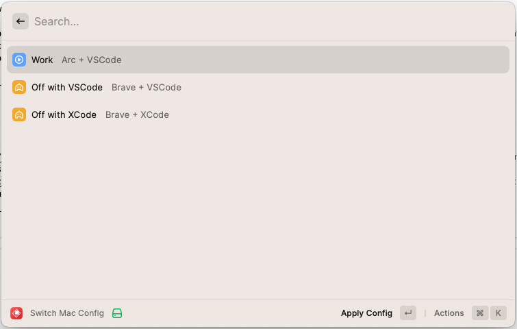

# switch-mac-config

Quickly switch default browser and application shortcuts via BetterTouchTool and Finicky.

## Why?

- Are you using several browsers to keep your personal and work environments separated?
- Would you like to be able to quickly switch your default browser, e.g. when you stop working?
- Are you frustrated when you open a Youtube link in your work browser but you'd rather have it open in your personal browser so that you can add it to your "Watch later" list?
- Do you use keyboard shortcuts to quickly open/switch to your most used applications, like your browser or IDE?
- Would you like to have those a predefined configuration and being able to switch between them quickly?

Well, you can, using the following tools and this Raycast extension.

## How?

Using the following tools:

- [BetterTouchTool](https://folivora.ai/): enables to highly customize your Mac. I'm mostly using it to add/rewrite keyboard shortcuts, in particular a bunch of shortcuts to quickly switch/open my terminal, IDE, browser, Postman, Dash...
- [Finicky](https://github.com/johnste/finicky): use it to route different URLs to different browsers or quickly switch your default browser. Finicky acts as your default browser and you can then have it route any URL based on rules you write in Javascript.
- [Raycast](https://raycast.com/): the command-center to quickly select the configuration you want to use.

And this Raycast extension.

